# UX Rework Next Phase (Handoff Plan)

This document is a **handoff** for continuing the “ARES web rework: real flow, real data, real buttons” effort on another device or by another agent.

It is based on the Cursor plan at `C:\Users\FTHMo\.cursor\plans\ux_rework_and_wiring_6db7a4e9.plan.md`, but adds **codebase context**, **exact file locations**, and **what’s already implemented** in this repo.

## TL;DR

- **Goal**: canonical user flow (wallet → billing → scan → detections → reports) and **no dead buttons / no mock data** in the web UI.
- **Status in repo right now**: we already removed multiple dead pages and introduced health + notification scaffolding.
- **Next**: implement `targets` storage + API + UI, add `runs` page, add findings status, make reports async real, replace dashboard KPIs with real analytics.

---

## Canonical User Journey

```mermaid
flowchart LR
  Land[Landing] --> Connect[Connect wallet SIWS]
  Connect --> Verify[/api/auth/verify cookie session/]
  Verify --> Overview[/dashboard/overview/]
  Overview --> Targets[/dashboard/targets/]
  Targets --> Scan[/api/scan enqueue/]
  Scan --> RunDetail[/dashboard/runs/:id/]
  RunDetail --> Detections[/dashboard/detections/]
  Detections --> Reports[/dashboard/reports/]
  Reports --> Billing[/dashboard/billing/]
```

---

## What is already implemented (in this repo)

These changes correspond to the early parts of the UX plan (cleanup + live health status + notification scaffolding).

### Removed dead/stub pages and orphan components

Deleted files:
- `apps/web/app/dashboard/profile/page.tsx`
- `apps/web/app/dashboard/investigations/page.tsx`
- `apps/web/app/dashboard/notifications/page.tsx`
- `apps/web/app/components/sidebar.tsx`
- `apps/web/app/components/top-bar.tsx`
- `apps/web/lib/ares/mock-data.ts`

### Navigation updates

Updated navigation to remove deleted routes and add `Runs` to the sidebar/footer:
- `apps/web/components/ares/sidebar.tsx` now includes `Runs` and no longer links `Investigations`.
- `apps/web/components/ares/site-footer.tsx` now includes `Runs` and no longer links `Investigations`.

### Live health status (wired to `/api/health`)

Existing health endpoint:
- `apps/web/app/api/health/route.ts` returns an envelope containing `status: "ok"|"degraded"` and `checks.{database,redis}`.

New client hook:
- `apps/web/lib/hooks/use-health.ts` polls `/api/health` every 30 seconds and exposes a `tone` (`live|degraded|offline|neutral`).

Updated `StatusBadge` to be live:
- `apps/web/components/ares/status-badge.tsx` now uses `useHealth()` and can show variants:
  - `operators` (default)
  - `system` (used in footer)
  - `monitoring` (used in dashboard topbar)

Dashboard topbar now displays live monitoring indicator and uses a notification bell component:
- `apps/web/app/dashboard/layout.tsx`
- `apps/web/components/ares/health-indicator.tsx` is now a wrapper using `StatusBadge variant="monitoring"`.

### Notification bell scaffolding (API will be implemented later)

New component:
- `apps/web/components/ares/notification-bell.tsx` polls `/api/notifications` every 30 seconds and shows a dropdown.

Important: **`/api/notifications` does not exist yet**. This is expected until the later phase where we add the DB table + endpoint.

### Types moved out of mock data

New types file:
- `apps/web/lib/ares/types.ts`

Note: only a minimal set of types were added for UI consumption and will likely be expanded as endpoints are implemented.

---

## Current known gaps (still broken UX)

These are the biggest remaining issues, matching the original plan.

### Targets are not real
- `/dashboard/targets` currently synthesizes “targets” from posture/findings (fake).
- Need DB table + CRUD endpoints + onboard modal.

### Many CTAs still non-functional
Examples:
- `/dashboard/detections` actions (Dismiss All, Investigate) are currently stubs.
- `/dashboard/reports` synthesis uses simulated delay; `POST /api/reports` is currently a stub.
- `/dashboard/settings` has a non-functional Save flow.
- Landing page still links `/chronicle/*` and integrations page links `/docs` (dead routes) — these must be removed in the later landing rewrite task.

---

## Repo map: where things live

### Web app (UI + API)
- UI pages: `apps/web/app/**/page.tsx`
- API routes: `apps/web/app/api/**/route.ts`
- Shared libs: `apps/web/lib/**`
- Shared UI: `apps/web/components/**`

### Worker
- `apps/worker/src/**`
- Queue package: `packages/queue/**`

### DB schema / migrations
- `apps/chain-intake/sql/*.sql`
  - Current schema includes: `wallets`, `credits_ledger`, `purchases`, `payment_provider_events`, `runs`, `findings`, `reports`, `report_artifacts`, `pricing_catalog` (see existing migration `006_runs_findings_reports.sql` etc.)

---

## Next phase execution checklist (the remaining plan, with exact pointers)

The “next agent” should execute the following in order.

### 1) Finish cleanup of dead marketing routes

Replace/remove dead links:
- Landing chronicle links and the `THREADS/NEWS/QUOTES` sections: `apps/web/app/page.tsx`
  - Remove any `href="/chronicle..."` and the hardcoded arrays.
- Integrations docs link: `apps/web/app/integrations/page.tsx`
  - Replace `href="/docs"` with a real destination (or remove).

This corresponds to the plan items “landing real content” and “IA removals”.

### 2) Targets: DB table + API (foundation for “Onboard Asset”)

Add migration:
- `apps/chain-intake/sql/009_targets.sql`
  - table: `targets(id uuid pk, wallet text, kind text, identifier text, label text, created_at timestamptz, last_scanned_at timestamptz, last_run_id uuid, archived_at timestamptz)`
  - indexes: `(wallet, archived_at)` and `(wallet, created_at desc)`

Add API routes:
- `apps/web/app/api/targets/route.ts` (`GET`, `POST`)
- `apps/web/app/api/targets/[id]/route.ts` (`GET`, `PATCH`, `DELETE`)
- `apps/web/app/api/targets/[id]/scan/route.ts` (`POST`)

Implementation notes:
- Enforce wallet scoping using the existing session tooling (see `/api/billing/*` for examples).
- Follow the API envelope style (`apiSuccess/apiError`) in `apps/web/lib/api.ts`.
- The scan endpoint should call the same queue client used by `apps/web/app/api/scan/route.ts` and create a `runs` record (or call existing scan route).

Add lib helper:
- `apps/web/lib/targets/store.ts` (SQL helpers used by the API routes).

### 3) Rewrite `/dashboard/targets` page to be real

File:
- `apps/web/app/dashboard/targets/page.tsx`

Required UI behavior:
- “Onboard Asset” opens a modal (new component e.g. `apps/web/components/targets/onboard-target-dialog.tsx`).
- Submit calls `POST /api/targets`.
- Each row has “Re-scan” → `POST /api/targets/[id]/scan` then navigates to `/dashboard/runs/[runId]` (or `/dashboard/runs/[id]` once implemented).
- Kebab menu supports archive/delete.

### 4) Add `/dashboard/runs` page (list view)

New file:
- `apps/web/app/dashboard/runs/page.tsx`

Data:
- consume existing `GET /api/runs` (`apps/web/app/api/runs/route.ts`)

### 5) Findings status support (make detections actions real)

DB migration:
- `apps/chain-intake/sql/010_findings_status.sql` add columns to `findings`:
  - `status`, `resolved_at`, `resolved_by_wallet`, `notes`
  - backfill existing to `open`

API:
- `apps/web/app/api/findings/[id]/route.ts` (`PATCH` status/notes)

Lib:
- `apps/web/lib/findings/status.ts`

Update listing endpoint:
- `apps/web/app/api/findings/route.ts` should include `status` in returned objects when DB-backed.

### 6) Rewrite `/dashboard/detections` page

File:
- `apps/web/app/dashboard/detections/page.tsx`

Behavior:
- Real search/filter on the in-memory list.
- Per-finding action to set status via PATCH.
- “Dismiss All” = bulk update (either loop PATCH or add a bulk endpoint).

### 7) Make reports real async (remove synthesis simulation)

API:
- `apps/web/app/api/reports/route.ts` `POST` should enqueue `report-synthesis` job and create a `runs` record of kind `report`, return `runId`.

Worker:
- add `apps/worker/src/handlers/reportSynthesis.ts`
  - select findings for wallet/run
  - render PDF (use existing report tooling already in worker/web or add a small template)
  - upload to R2 using existing object store wrapper
  - insert `reports` and `report_artifacts`

UI:
- `apps/web/app/dashboard/reports/page.tsx` should poll `/api/runs/[id]` until terminal and then refresh `GET /api/reports`.

### 8) Overview KPIs must be real

New endpoint:
- `apps/web/app/api/analytics/overview/route.ts` aggregations per wallet:
  - open findings by severity
  - runs in last 7 days
  - credits burn rate (optional but planned)
  - last successful run

UI:
- `apps/web/app/dashboard/overview/page.tsx` should use it and remove any hardcoded/statically derived numbers.

### 9) Notifications (back the bell dropdown)

Migration:
- `apps/chain-intake/sql/011_notifications.sql`

API:
- `apps/web/app/api/notifications/route.ts` (`GET` list + unread count, `POST mark-all-read`)

Emit notifications from:
- PayAI webhook: `apps/web/app/api/billing/webhooks/payai/route.ts`
- scan enqueue/finish (where runs transition status)
- report synthesis completion
- admin adjustments

### 10) Agents live status

API:
- `apps/web/app/api/agents/status/route.ts` should compute:
  - last run time per agent/skill
  - success rate over a time window (7d)
  - in-flight jobs from queue (BullMQ)

UI:
- rewrite `apps/web/app/dashboard/agents/page.tsx` as read-only status board.

### 11) Console vitals + admin queue controls

API:
- `apps/web/app/api/console/vitals/route.ts` (queue depth, worker count, db pool ok)
- admin: `apps/web/app/api/admin/queue/*` (pause/resume/drain)

UI:
- `apps/web/app/dashboard/console/page.tsx` remove hardcoded CPU/MEM values and show real vitals.

### 12) Settings & preferences

Migration:
- `apps/chain-intake/sql/012_user_preferences.sql`

API:
- `apps/web/app/api/preferences/route.ts` (`GET`, `PATCH`)

UI:
- rewrite `apps/web/app/dashboard/settings/page.tsx` to a real save flow and remove dead “rotate keys” style elements.

---

## Build/verification commands

From repo root (Windows PowerShell):

- Install deps:
  - `corepack enable`
  - `pnpm install`
- Web build:
  - `pnpm --filter @asst/web build`
- Typecheck (if configured):
  - `pnpm -r typecheck`

---

## Notes for the next agent

- The repo uses Next.js App Router and wraps API responses with `apiSuccess` / `apiError` in `apps/web/lib/api.ts`.
- Many endpoints are wallet-scoped; follow patterns in billing routes for `readWalletSession` + ownership checks.
- Avoid re-introducing “mock arrays” in UI pages; use real endpoints even if the endpoint is minimal at first.
- The notification bell UI is already added; it needs `/api/notifications` to exist (planned in the later step).

